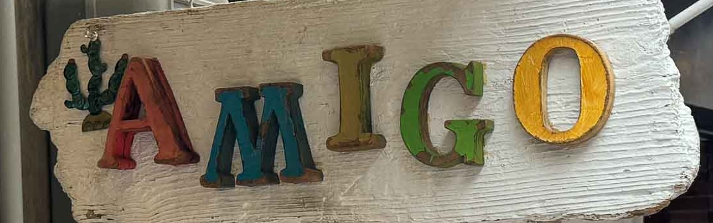

# AMIGO

AMIGO: Aperture Masking Interferometry Generative Observations. An end-to-end differentiable modelling pipeline for JWST AMI go brrrrrrrr

The [documentation](https://louisdesdoigts.github.io/amigo/) is currently under development

- 📦 [Example Notebooks](https://github.com/LouisDesdoigts/amigo_notebooks) (In the process of being updated)
- 📄 [Amigo Paper](https://arxiv.org/abs/2510.09806) (cite this if you use Amigo!)
- 📄 [Amigo Image Reconstruction Paper](https://arxiv.org/abs/2510.10924)

If you have any questions or need help, feel free to open an issue on the GitHub repository or reach out to the community.

